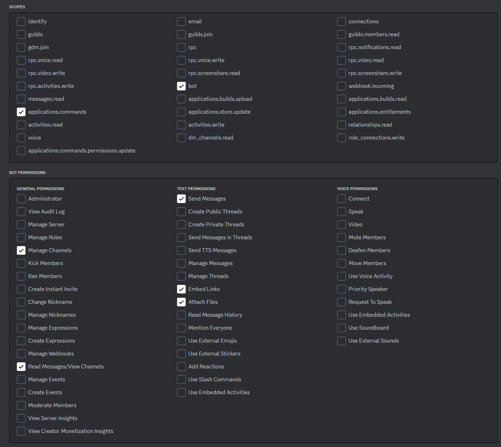
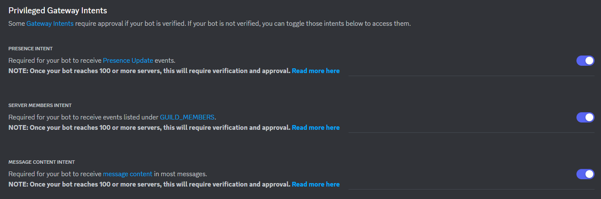

# guysvintedbot
This repo contains all the resources for our own Vinted Discord bot project.

# Prerequisites

- AWS machine (guysmachine)
- Python 3.11
- **vintedbot_api** running locally

# Installation & Usage

### Bot creation and ENV variables
- Create a Discord bot (https://discord.com/developers/applications) with correct permissions and privileges:

- Invite the bot on your Discord server
- Create **CLOTHES**, **LOGS** and **STOCK** channels (names can be changed) on your Discord server
- Create the **.env** file by copy-pasting **.env.sample** and filling the ENV variables

### Run the bot
- Run whatever **run/run_*.sh** file to install the required **venv** and run the bot in background. Associated log file is **guysvintedbot_*.log** (UTC timezone)
- The bot will then start using API **HOST**=127.0.0.1, **PORT**=8000 for prod, 5000 for dev, 5001 for hugo, 5002 for nico
- Useful command to kill the bot: $ps -aux | grep 'main' to retrieve **PID**, then $kill -9 PID

# Deployment

To deploy the project on **guysmachine**, you will first need to own an authorized SSH key. Then, you can run the **rsync/rsync_*.sh** file related to the target remote directory:

- **rsync/rsync_prod**: you need to be on branch **main**, the project will be sent to **guysmachine:~/guysvintedbot/vintedbot_prod**
- **rsync/rsync_dev:** you need to be on branch **dev**, the project will be sent to **guysmachine:~/guysvintedbot/vintedbot_dev**
- **rsync/rsync_nico:** you need to be on neither branch **main** nor **dev**, the project will be sent to **guysmachine:~/guysvintedbot/tests/nico**
- **rsync/rsync_hugo:** you need to be on neither branch **main** nor **dev**, the project will be sent to **guysmachine:~/guysvintedbot/tests/hugo**

These scripts can of course be adapted to sync remotely on any other machine depending on your needs.

# Available functionalities

All the functionalities are documented on the **guysvinted** Discord server

# Important note

Please note that the project is not currently maintained and Vinted clothes cannot be retrieved by the API anymore in the current state.
